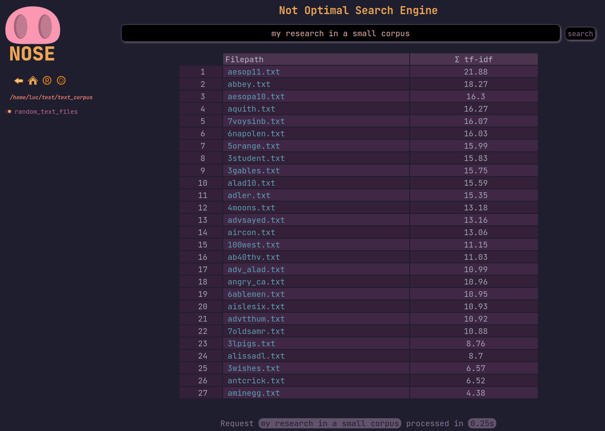

# Not Optimal Search Engine

`nose` is a local search engine that computes [**tf-idf**](https://en.wikipedia.org/wiki/Tf%E2%80%93idf) scores for every terms of any number of parsable documents. It can locally serve a small php webpage where you can browse and search in your computer folders.
Inspired from [seroost](https://github.com/tsoding/seroost).

<p align="center">

</p>

<p align="center">
<b><i>It is in development, no big documentation for now, use at your own risks</i></b>
</p>


## Quick launch

```bash
git clone https://github.com/dougy147/nose
cd nose
./nose -s
```

## Functionalities

| Option   | Function                                                                 |
|-------------|-----------------------------------------------------------------------|
| **`-i`**  | Index a corpus of directories and/or files                               |
| **`-p`**  | Parse files and computes tf-idf                                          |
| **`-e`**  | Index and parse directories and/or files respectively to their context   |
| **`-f`**  | Find best matching files given a query                                   |
| **`-q`**  | Quick find (computes tf-idf only for the queries terms)                  |
| **`-s`**  | Serve a local webpage                                                    |
| **`-h`**  | Display help menu                                                        |


**Indexing** : Takes any number of files and/or directories as input.
Then creates `index.nose`, containing a list of all files discovered.
Indexer considers the corpus as a whole when computing tf-idf scores.

**Parsing** : Parse every extension-compatible files given an index (by default `./out/indexer/index.nose`). After parsing, it computes every **tf-idf** and stores informations in `full_dict.nose`.

**Exploring** : Output one index per single directory. The best matching documents **per single directories**  will be on top.

**Finding** : Find the best matching files given any user input.

**Serving** : Serve your indexes locally at `http://127.0.0.1:1111`.


### Dependencies

- awk / bc / find / grep
- pdftotext (parse pdf) `yay -S python-pdftotext`
- php (server mode)
